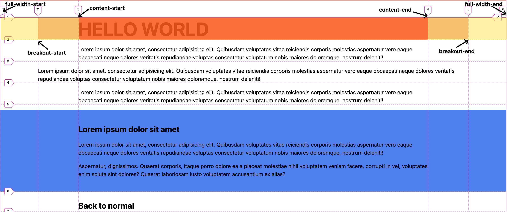

# CSS-Grid Named Columns example [[MDN](https://developer.mozilla.org/en-US/docs/Web/CSS/CSS_grid_layout/Grid_layout_using_named_grid_lines)]

### Demonstrates the possibilities of named spaces in term of containers, content and transformations of them

---

## Anatomy

You can set custom name for `columns`, `areas`

```css
.parent {
  display: grid;
  // ...
  // ...
  grid-template-columns:
    [child-start] minmax(...)
    [child-end] minmax(...);
}

.child {
  grid-column: child;
}
```

or

```css
.parent {
  display: grid;
  // ...
  // ...
  grid-template-areas:
    "child1 child2 child3"
    "child1 child2 child3"
    "child1 child2 child3";
}

.child1 {
  grid-area: child1;
}

.child2 {
  grid-area: child2;
}

.child3 {
  grid-area: child3;
}

.child-overlay {
  grid-row: 2;
  grid-column: child1-start / child2-end;
}
```

---

## Example Anatomy



> [!IMPORTANT]
> You can NOT nest classnames inside `content-grid` class! All utility classes have to be ONLY as children of the root `content-grid` class

✅ Do

```html
<main class="flow content-grid">
  <section class="full-width bg-primary flow">
    <h2>Lorem ipsum dolor sit amet</h2>
    <p>
      Lorem ipsum dolor sit amet, consectetur adipisicing elit. Quibusdam
      voluptates vitae reiciendis corporis molestias aspernatur vero eaque
      obcaecati neque dolores veritatis repudiandae voluptas consectetur
      voluptatum nobis maiores doloremque, nostrum deleniti!
    </p>
  </section>
  <p class="breakout">
    Lorem ipsum dolor sit amet, consectetur adipisicing elit. Quibusdam
    voluptates vitae reiciendis corporis molestias aspernatur vero eaque
    obcaecati neque dolores veritatis repudiandae voluptas consectetur
    voluptatum nobis maiores doloremque, nostrum deleniti!
  </p>
  <p>
    Lorem ipsum dolor sit amet, consectetur adipisicing elit. Quibusdam
    voluptates vitae reiciendis corporis molestias aspernatur vero eaque
    obcaecati neque dolores veritatis repudiandae voluptas consectetur
    voluptatum nobis maiores doloremque, nostrum deleniti!
  </p>
</main>
```

❌ Do NOT (nest utility classes one in other: like full-width > breakout)

```html
<main class="flow content-grid">
  <section class="full-width bg-primary flow">
    <h2>Lorem ipsum dolor sit amet</h2>
    <p class="breakout">
      Lorem ipsum dolor sit amet, consectetur adipisicing elit. Quibusdam
      voluptates vitae reiciendis corporis molestias aspernatur vero eaque
      obcaecati neque dolores veritatis repudiandae voluptas consectetur
      voluptatum nobis maiores doloremque, nostrum deleniti!
    </p>
  </section>
</main>
```

### Full width content

#### Full width image

```html
<main class="flow content-grid">
  
</main>
```

#### Full width block with containered content

```html
<main class="flow content-grid">
  <section class="full-width bg-primary flow">
    <h2>Lorem ipsum dolor sit amet</h2>
    <p>
      Lorem ipsum dolor sit amet, consectetur adipisicing elit. Quibusdam
      voluptates vitae reiciendis corporis molestias aspernatur vero eaque
      obcaecati neque dolores veritatis repudiandae voluptas consectetur
      voluptatum nobis maiores doloremque, nostrum deleniti!
    </p>
  </section>
</main>
```

---

### Breakout content

```html
<main class="flow content-grid">
  <p class="breakout">
    Lorem ipsum dolor sit amet, consectetur adipisicing elit. Quibusdam
    voluptates vitae reiciendis corporis molestias aspernatur vero eaque
    obcaecati neque dolores veritatis repudiandae voluptas consectetur
    voluptatum nobis maiores doloremque, nostrum deleniti!
  </p>
</main>
```

---

### Regular container

```css
<main class="flow content-grid">
  <p>
    Lorem ipsum dolor sit amet, consectetur adipisicing elit. Quibusdam
    voluptates vitae reiciendis corporis molestias aspernatur vero eaque
    obcaecati neque dolores veritatis repudiandae voluptas consectetur
    voluptatum nobis maiores doloremque, nostrum deleniti!
  </p>
</main>
```
